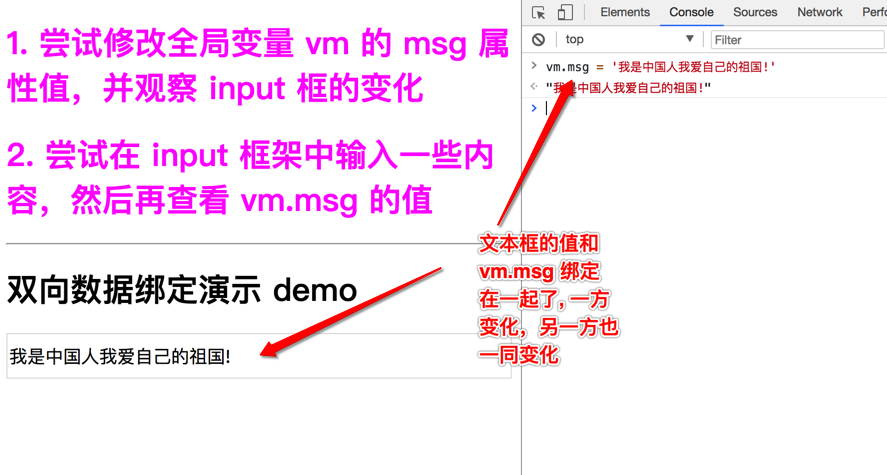

## 什么是双向数据绑定?

> 刚送走了单向数据绑定，又来了双向！是更神圣的存在？还是。。。。
>
> 人类可不只是满足于单向，除了要让数据变化后自动更新到页面，也希望页面变化后，JavaScript 中的数据也自动的更新。

 废话少说，直接看效果!

<a href="../demo/05.two-way-data-binding.html" target="_blank">双向数据绑定演示在案例</a>

注意观察演示案例，会发现：

1. 当我们修改 ` vm.msg` 的值时, 页面 `input`中的内容随之变化
2. 当我们修改 `input` 中的内容时，`vm.msg` 的值也会随之变化

上面这种现象其实就是双向数据绑定了，指的就是 input 的值似乎和 vm.msg 的值绑在一起，其中一个变化，另一个也随之变化。

## 总结

以前端为例: 

我们从后端得到数据后，要将数据呈现到 DOM 中，则需要做 DOM 操作 【**烦!!!!**】

用户在表单中输入数据后提交，我们又要从 DOM 中读取表单中的值，需要做 DOM 操作 【**烦!!!**】

而双向数据绑定是什么呢？

当我们修改 JavaScript 中的数据时(可能就是某个变量), 相应的 DOM 会自动呈现新的数据。反之，当我们在表单中输入新内容时，JavaScript 中某个数据也会自动的得到表单中新的数据。这种现象就可以称之为双向数据绑定

